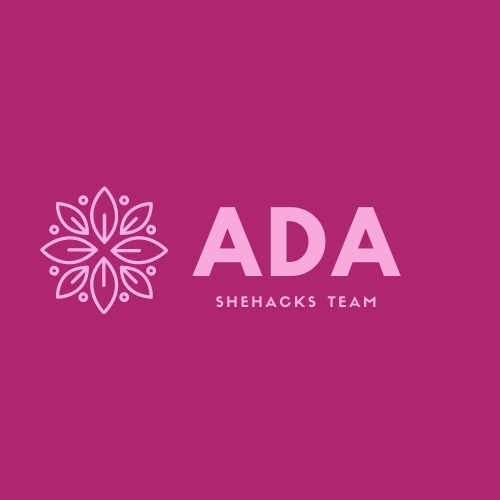
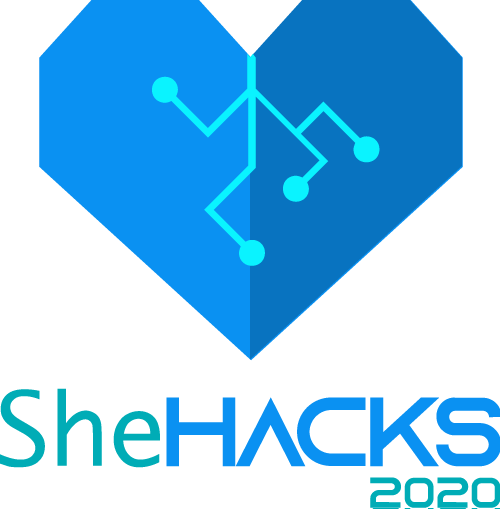

# GineApp - A agenda que te acolhe e te ajuda

    

GineApp é uma aplicação simples e robusta feita em HTML, CSS e VanillaJS, pelo time Ada do SheHacks 2020. Como o GineApp futuramente se tornará numa plataforma somente para dispositivos móveis, o site foi desenvolvido com olhos para o mobile e usando PWA! (mas nada impede de usar o desktop)

Nesse projeto está composto por nossas três primeiras páginas iniciais:
  - Login
  - Cadastro
  - Página inicial do aplicativo

## Ferramentas e Rescursos

  - HTML, CSS e VanillaJS
  - **Bootstrap**
  - **PWA**
  - Amarzenamento da dados de cadastro no **localStorage**

### Cadastro

Nosso cadastro é feito pelo armazenamento dos dados no localStorage, e assim, com os dados cadastrados, é possível a realização do login. Esses dados são cacheados no navegador e guardados num JSON, e no login, fazemos a verificação do cadastro.

### Cores utilizadas

Nossa paleta de cores está totalmente alinhada com a cores que escolhemos para o logotipo, que são as seguintes:
[https://coolors.co/c62e65-2f1847-3cacae-ffffff](https://coolors.co/c62e65-2f1847-3cacae-ffffff)

## Como rodar o projeto?
Clone o nosso projeto e abra a index.html no seu navegador e voilá!

## Quer acessar a melhor PWA do SheHacks? Vem pra cá!
Toma ai o link, e olha no celular também!! Se vc quiser usar a PWA, só ir nos três pontinhos do navegador do celular e clicar em Adicionar a Tela Inicial, que aí você vai ter um icone maravilhoso de aplicativo que vai direto para a nossa PWA: [https://vanessa-nascimento.github.io/gineapp/](https://vanessa-nascimento.github.io/gineapp/)

## Quem que fez esse arraso?
Esse time mavilhoso mesmo!

    

## Quem que proporcionou a criação desse projeto maravilhoso?
Quem mais seria né? #girlpower

    

